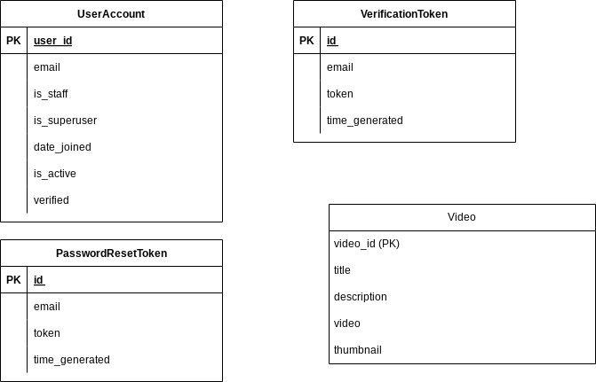

# Video Platform

## Project Objective
Paul Leonard is a video creator who needs a bespoke platform to upload videos for his customers, solely for his brand. This project aims to develop a video platform to meet Paul's requirements.

## Customer Requirements

### User Features:
1. **Signup & Login:**
   - Users can sign up and log in with an email and password.
   - Account verification is required.
   - Password reset feature to recover lost passwords.

2. **Navigation:**
   - Users can navigate video pages.
   - Share links to videos on different pages.

### Admin Features:
1. **Video Management:**
   - Admins can upload videos with a title, description and thumbnail.

### Video Page:
1. **Video Display:**
   - Displays only one video per page.
   - Includes next and previous buttons to load new pages with other videos.
   - Buttons are hidden when no further video can be loaded in either direction.
   - Common control buttons for users to control the video.
   - Boldly indicated business logo at the top.
   - Share button for users to share a link to the video page.

## Tech Stack
- **Frontend:** React with TypeScript
- **Backend:** Django REST Framework

## Getting Started

### Prerequisites
- Node.js
- npm or yarn
- Python
- pip

### Backend Setup

1. Clone the repository:
    ```sh
    git clone https://github.com/legend-crypt/Amalitech-Video-App 
    cd Amalitech-Video-App/server
    ```

2. Create a virtual environment and activate it:
    ```sh
    python3 -m venv env
    source env/bin/activate   # On Windows use `env\Scripts\activate`
    ```

3. Install the dependencies:
    ```sh
    pip install -r requirements.txt
    ```

4. Apply migrations:
    ```sh
    python manage.py migrate
    ```

5. Create a superuser for the admin interface:
    ```sh
    python manage.py createsuperuser
    ```

6. Run the server:
    ```sh
    python manage.py runserver
    ```

### Frontend Setup

1. Navigate to the frontend directory:
    ```sh
    cd ../client
    ```

2. Install the dependencies:
    ```sh
    npm install   # Or `yarn install` if you use Yarn
    ```

3. Start the development server:
    ```sh
    npm run dev   # Or `yarn start` if you use Yarn
    ```


# ERP



# DEPLOYED LINK:
- https://amalitech-video-app.vercel.app/